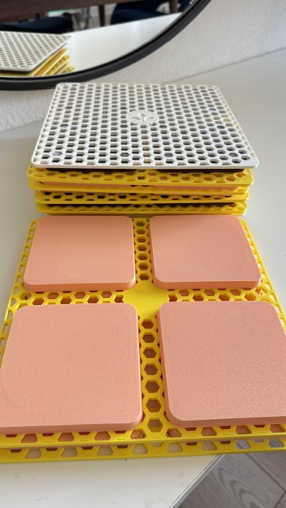
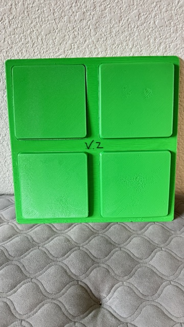
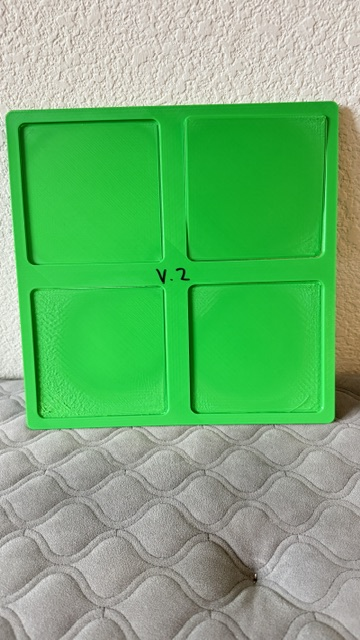
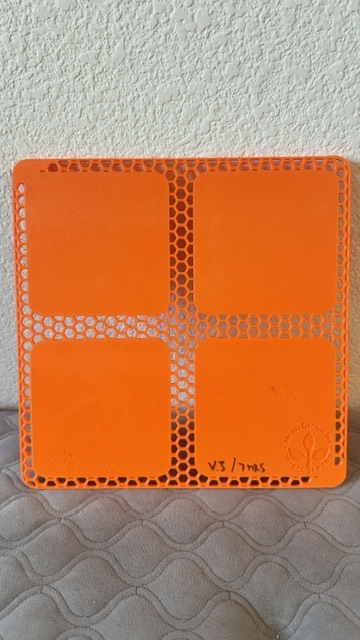
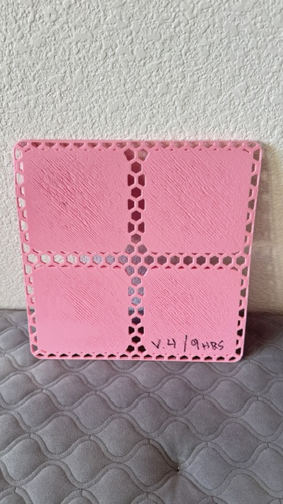
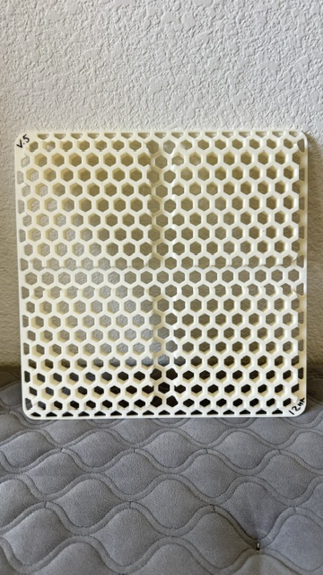
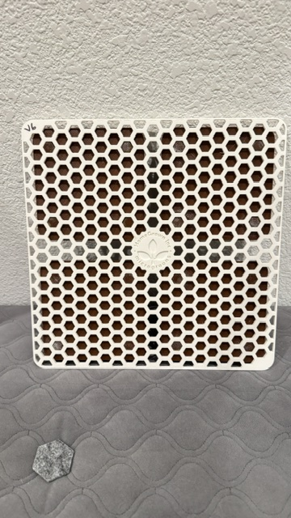
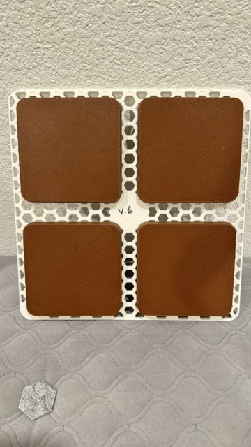

# Microgreens Growing Apparatus

A custom-designed growing apparatus built for [Homegrown Microgreens](https://www.instagram.com/homegrown_inc/), a Sacramento-based microgreens grower. The device ensures proper growth of roots into the soil during the seed's germination and prevents the growth of mold. It has been in daily use since February 2026.

---

## The Problem

Homegrown Microgreens needed a better way to apply weight to their seeds in order to ensure the roots of their seeds grew into the soil during germination. Their existing process required weighted plastic "grow cells" to be placed on top of growing seeds. These plastic cells had no ventilation, leading to the growth of mold in their seeds, rendering them unusable. 

I worked with the owners to understand exactly what they needed and what constraints I was designing around:

- Had to be compatible with their existing cells
- Cover 4 cells at a time
- Be stackable for storage

---

## My Design

*Fusion 360 model of the final design.*

The apparatus is built around pyramids that replace the plastic cells attached to a flat base which allows weight to be applied. Key design decisions:

- **Upside down pyramids** — Distributes weight across all 4 cells
- **Offset from cell walls** — Gives some breathability to soil
- **Hexagon pattern cavities** — Prevents mold growth through ventilation of soil
### Iterations

I went through 6 main revisions before landing on the final design:

1. **v1** — A single, solid pyramid designed for one cell. Too big and did not cover enough cells.
2. **v2** — Dimensions adjust to be thinner, made to work with 4 cells at a time.
3. **v3** — Negative space in a hexagon pattern on only the base. Allowed for some breathability but not enough.
4. **v4** — Indents opposite from pyramids added for easy stacking. Complicated printing with requirement of support material
5. **v5** — Indents removed, Negative hexagon pattern applied to entire apparatus. Did not allow for enough transfer of weight to entire top of soil.
6. **v6** — Pyramids made solid and separate from base, dividing print load between two machines, cutting down print times, and allowing for color customization of base and pyramids.

[V2]

[V3]

[V4]

[V5]

[V6]

---

## Results

- **Prevented loss of microgreens:** Prevented mold unlike previous method
- **Resources saved by HomeGrown:** Allows HomeGrown to use more of their cells for growing
- **Status:** Still in daily use as of June 2026

---

## Tools & Materials

**Design:**
- Fusion 360

**Fabrication:**
- Bambu Lab P1S + Creality K1 Max
- PLA filament

**Total cost per unit:** ~$5 in filament

---

## What I Learned

A few things I didn't expect going in:

- **Printbed size** — I did not anticipate printing anything bigger than the 256 by 256 millimeter (~10 inch) bed the Bambu Lab P1S had, ending up in the purchase of a Creality K1 Max for its bigger (approx. 12in x 12in print volume) bed size. 
- **Purpose-driven design** — I did not consider mold growth being a problem in either the use of the apparatus nor the use of plastic cells until it was brought to my attention by the owner of HomeGrown Inc. This greatly changed how I designed each version and allowed me to consider long-term effects of each design choice.
- **Foodsafe materials + hardware** — Because of its direct contact with the microgreen seeds, the apparatus must be food safe. This requires for food-safe hardware and materials throughout the manufacturing process, causing me to consider the material which the printer's extruder nozzles are made of (brass can leach lead into the filament, so stainless steel must be used instead) and what additives are in the filament.

If I built v7, I would:
- Consider the use of a food-grade epoxy/resin coat on surfaces that touch the seeds
- Implement indents for stacking/storage
---

## Files in this repo

- `design/HGIV6.f3z` — Fusion 360 source file
- `design/HGIV6.stl/, design/HGIV6-pyramid.stl/` — Exported STL files for printing
- `images/` — Photos of the build process and finished device

---

## About me

I'm Ethan Zamora, a 16-year-old engineer in Sacramento. I've been 3D printing and designing in Fusion 360 since I was 9. I'm president of my high school's engineering club and section leader in marching band. My goal is to study engineering at MIT.

📫 ethanzam23@gmail.com
